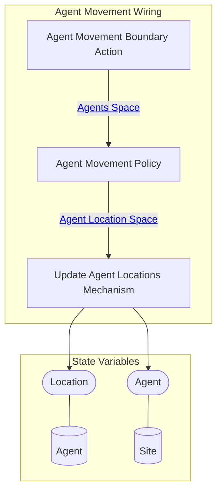

## Wiring Diagram (Zoomed Out)

- For display of only depth of 1 in the components/nested wirings

## Wiring Diagram

## Description

Block Type: Stack Block
Wiring for agents moving
## Components
1. [[Agent Movement Boundary Action]]
2. [[Agent Movement Policy]]
3. [[Update Agent Locations Mechanism]]

## All Blocks
1. [[Agent Movement Boundary Action]]
2. [[Agent Movement Policy]]
3. [[Update Agent Locations Mechanism]]

## Constraints

## Domain Spaces
1. [[Empty Space]]

## Codomain Spaces
1. [[Terminating Space]]

## All Spaces Used
1. [[Agent Location Space]]
2. [[Agents Space]]
3. [[Empty Space]]
4. [[Terminating Space]]

## Metrics Used
1. [[Neighboring Valid Tiles Metric]]
2. [[Open Locations Stateful Metric]]

## Parameters Used

## Called By

## Calls

## All State Updates
1. [[Agent]].[[Agent State-Location|Location]]
2. [[Site]].[[Site State-Agent|Agent]]

