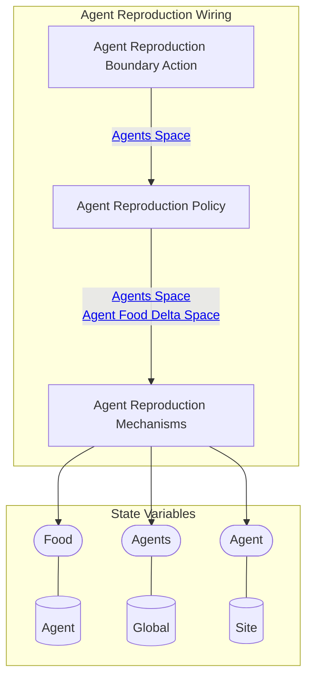
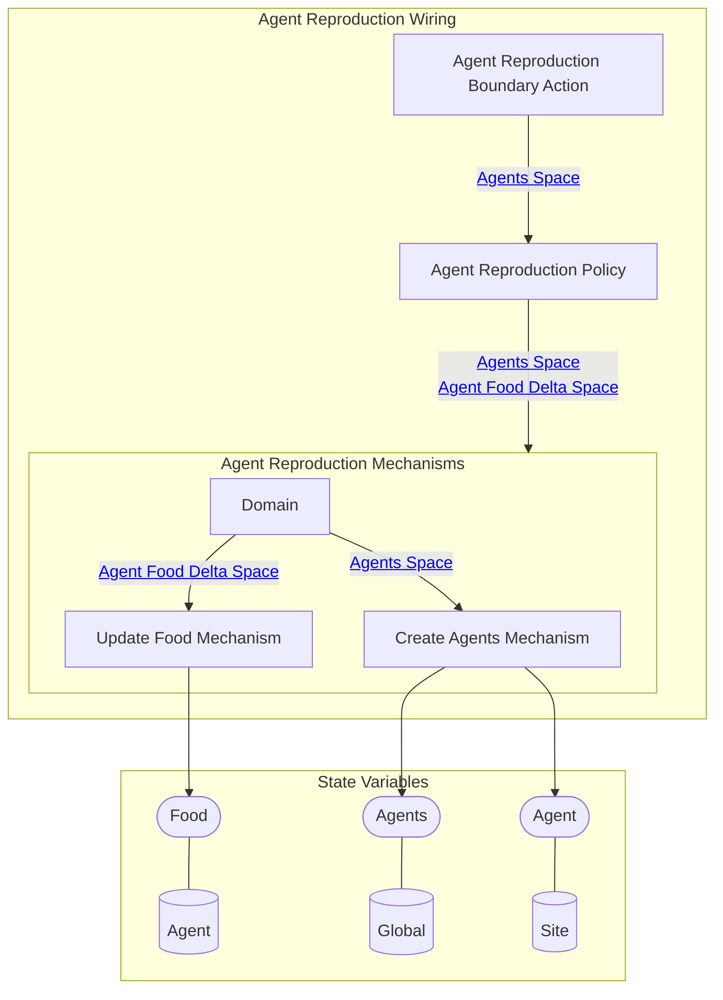

## Wiring Diagram (Zoomed Out)

- For display of only depth of 1 in the components/nested wirings

## Wiring Diagram

## Description

Block Type: Stack Block
Wiring for agents hunting prey
## Components
1. [[Agent Reproduction Boundary Action]]
2. [[Agent Reproduction Policy]]
3. [[Agent Reproduction Mechanisms]]

## All Blocks
1. [[Agent Reproduction Boundary Action]]
2. [[Agent Reproduction Policy]]
3. [[Create Agents Mechanism]]
4. [[Update Food Mechanism]]

## Constraints

## Domain Spaces
1. [[Empty Space]]

## Codomain Spaces
1. [[Empty Space]]

## All Spaces Used
1. [[Agent Food Delta Space]]
2. [[Agents Space]]
3. [[Empty Space]]
4. [[Terminating Space]]

## Metrics Used
1. [[Is Neighbor Metric]]
2. [[Neighboring Valid Tiles Metric]]
3. [[Open Locations Stateful Metric]]
4. [[Predator Stateful Metric]]
5. [[Prey Stateful Metric]]

## Parameters Used
1. [[Reproduction Food Needed]]
2. [[Reproduction Food Threshold]]
3. [[Reproduction Probability]]

## Called By

## Calls

## All State Updates
1. [[Agent]].[[Agent State-Food|Food]]
2. [[Global]].[[Global State-Agents|Agents]]
3. [[Site]].[[Site State-Agent|Agent]]

## Spec Source Code Location

Spec Path (only works if vault is opened at level including the src folder): [../../../../src/Wiring/Agent.py#L116](../../../../src/Wiring/Agent.py#L116)

