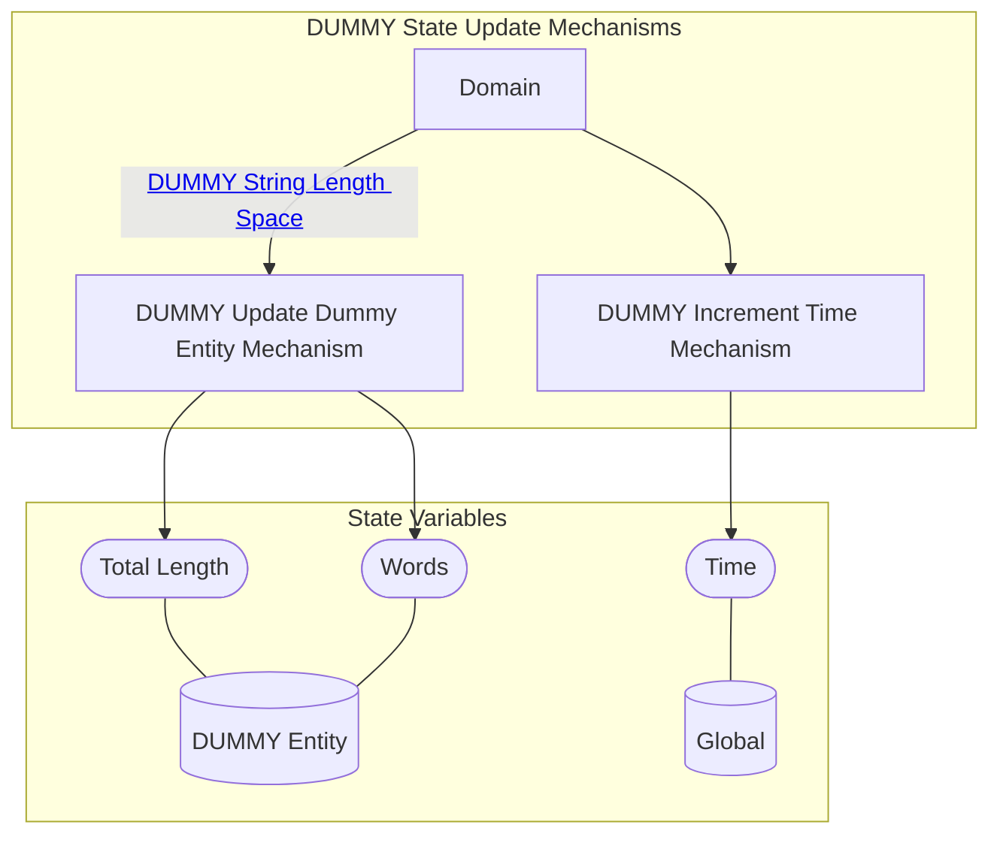

## Wiring Diagram (Zoomed Out)

- For display of only depth of 1 in the components/nested wirings

## Wiring Diagram

## Description

Block Type: Parallel Block
Mechanisms for updating the state of the system
## Components
1. [[DUMMY Update Dummy Entity Mechanism]]
2. [[DUMMY Increment Time Mechanism]]

## All Blocks
1. [[DUMMY Increment Time Mechanism]]
2. [[DUMMY Update Dummy Entity Mechanism]]

## Constraints

## Domain Spaces
1. [[DUMMY String Length Space]]

## Codomain Spaces
1. [[Empty Space]]

## All Spaces Used
1. [[DUMMY String Length Space]]
2. [[Empty Space]]
3. [[Terminating Space]]

## Metrics Used

## Parameters Used

## Called By

## Calls

## All State Updates
1. [[DUMMY Entity]].[[DUMMY State-Total Length|Total Length]]
2. [[DUMMY Entity]].[[DUMMY State-Words|Words]]
3. [[Global]].[[Global State-Time|Time]]

