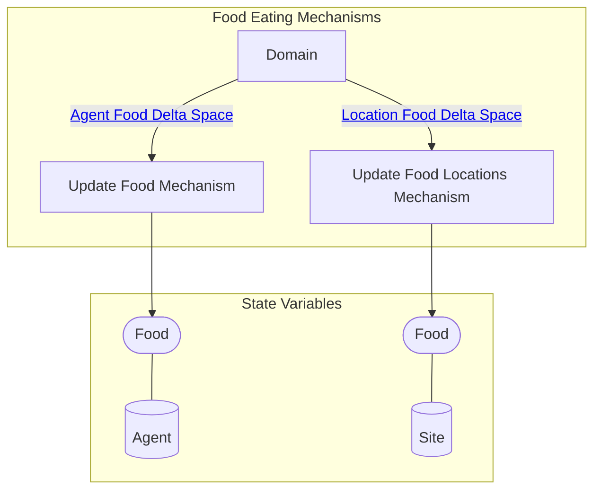

## Wiring Diagram (Zoomed Out)

- For display of only depth of 1 in the components/nested wirings

## Wiring Diagram

## Description

Block Type: Parallel Block
Mechanisms for when food is eaten by prey
## Components
1. [[Update Food Locations Mechanism]]
2. [[Update Food Mechanism]]

## All Blocks
1. [[Update Food Locations Mechanism]]
2. [[Update Food Mechanism]]

## Constraints

## Domain Spaces
1. [[Location Food Delta Space]]
2. [[Agent Food Delta Space]]

## Codomain Spaces
1. [[Empty Space]]

## All Spaces Used
1. [[Agent Food Delta Space]]
2. [[Empty Space]]
3. [[Location Food Delta Space]]
4. [[Terminating Space]]

## Metrics Used

## Parameters Used

## Called By

## Calls

## All State Updates
1. [[Agent]].[[Agent State-Food|Food]]
2. [[Site]].[[Site State-Food|Food]]

