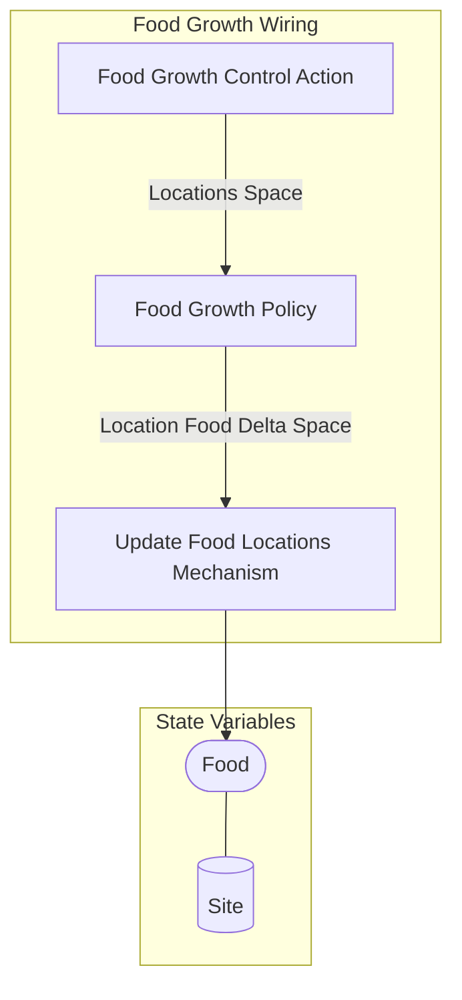

## Wiring Diagram (Zoomed Out)

- For display of only depth of 1 in the components/nested wirings

## Wiring Diagram

## Description

Block Type: Stack Block
Wiring for growth of food
## Components
1. [[Food Growth Control Action]]
2. [[Food Growth Policy]]
3. [[Update Food Locations Mechanism]]

## All Blocks
1. [[Food Growth Control Action]]
2. [[Food Growth Policy]]
3. [[Update Food Locations Mechanism]]

## Constraints

## Domain Spaces
1. [[Empty Space]]

## Codomain Spaces
1. [[Terminating Space]]

## All Spaces Used
1. [[Empty Space]]
2. [[Location Food Delta Space]]
3. [[Locations Space]]
4. [[Terminating Space]]

## Metrics Used

## Parameters Used
1. [[Food Growth Rate]]
2. [[Maximum Food per Tile]]

## Called By

## Calls

## All State Updates
1. [[Site]].[[Site State-Food|Food]]

