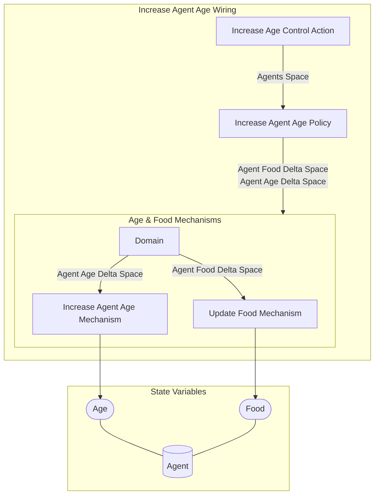

## Wiring Diagram

## Description

Block Type: Stack Block
Wiring for updating of the agent age and decreasing their food from aging
## Components
1. [[Increase Age Control Action]]
2. [[Increase Agent Age Policy]]
3. [[Age & Food Mechanisms]]

## All Blocks
1. [[Increase Age Control Action]]
2. [[Increase Agent Age Mechanism]]
3. [[Increase Agent Age Policy]]
4. [[Update Food Mechanism]]

## Constraints

## Domain Spaces
1. [[Empty Space]]

## Codomain Spaces
1. [[Empty Space]]

## All Spaces Used
1. [[Agent Age Delta Space]]
2. [[Agent Food Delta Space]]
3. [[Agents Space]]
4. [[Empty Space]]
5. [[Terminating Space]]

## Metrics Used

## Parameters Used

## Called By

## Calls

## All State Updates
1. [[Agent]].[[Agent State-Age|Age]]
2. [[Agent]].[[Agent State-Food|Food]]

