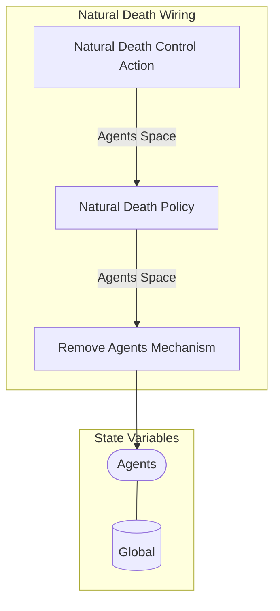

## Wiring Diagram

## Description

Block Type: Stack Block
Wiring for growth of food
## Components
1. [[Natural Death Control Action]]
2. [[Natural Death Policy]]
3. [[Remove Agents Mechanism]]

## All Blocks
1. [[Natural Death Control Action]]
2. [[Natural Death Policy]]
3. [[Remove Agents Mechanism]]

## Constraints

## Domain Spaces
1. [[Empty Space]]

## Codomain Spaces
1. [[Terminating Space]]

## All Spaces Used
1. [[Agents Space]]
2. [[Empty Space]]
3. [[Terminating Space]]

## Parameters Used
1. [[Maximum Age Parameter]]

## Called By

## Calls

## All State Updates
1. [[Global]].[[Global State-Agents|Agents]]

