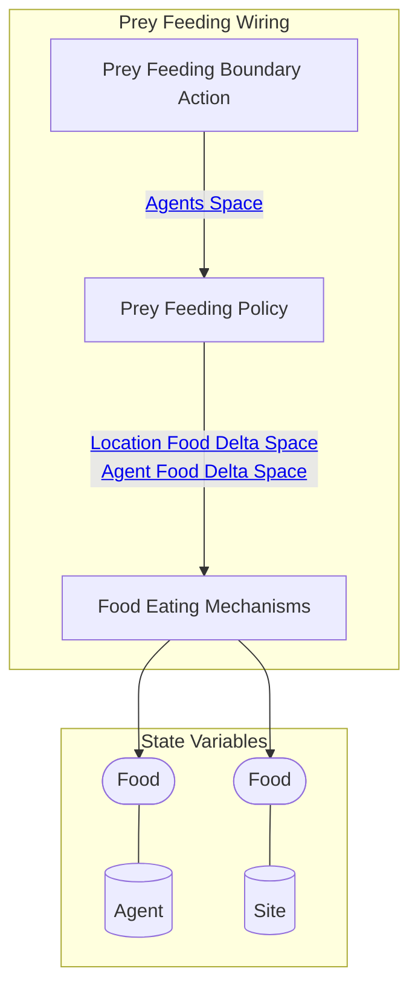
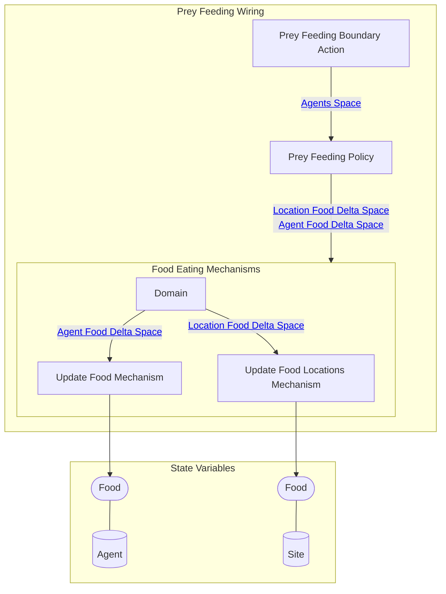

## Wiring Diagram (Zoomed Out)

- For display of only depth of 1 in the components/nested wirings

## Wiring Diagram

## Description

Block Type: Stack Block
Wiring for when prey eats food
## Components
1. [[Prey Feeding Boundary Action]]
2. [[Prey Feeding Policy]]
3. [[Food Eating Mechanisms]]

## All Blocks
1. [[Prey Feeding Boundary Action]]
2. [[Prey Feeding Policy]]
3. [[Update Food Locations Mechanism]]
4. [[Update Food Mechanism]]

## Constraints

## Domain Spaces
1. [[Empty Space]]

## Codomain Spaces
1. [[Empty Space]]

## All Spaces Used
1. [[Agent Food Delta Space]]
2. [[Agents Space]]
3. [[Empty Space]]
4. [[Location Food Delta Space]]
5. [[Terminating Space]]

## Metrics Used
1. [[Available Food Metric]]
2. [[Prey Stateful Metric]]

## Parameters Used
1. [[Hunger Threshold]]

## Called By

## Calls

## All State Updates
1. [[Agent]].[[Agent State-Food|Food]]
2. [[Site]].[[Site State-Food|Food]]

