## Wiring Diagram (Zoomed Out)

- For display of only depth of 1 in the components/nested wirings

## Wiring Diagram

```mermaid
graph TB

subgraph SVS["State Variables"]
EE0[("Global")]
EES0(["Simulation Log"])
EES0 --- EE0
EES1(["Timestep"])
EES1 --- EE0
end

subgraph X5["Simulation Meta Mechanisms"]
direction TB
X1["Increment Time Mechanism"]
X1 --> EES1
X2["Log Simulation Data Mechanism"]
X2 --> EES0
X3[Domain]

direction LR
direction TB
X3 --"<a href='Timestep Space' class=internal-link>Timestep Space</a>"--> X1
X3 --"<a href='Simulation Log Space' class=internal-link>Simulation Log Space</a>"--> X2
end
class X1 internal-link;
class X2 internal-link;
class X4 internal-link;
class EE0 internal-link;

```

## Description

Block Type: Parallel Block
Wiring for mechanisms that update the simulation log and simulation metadata
## Components
1. [[Increment Time Mechanism]]
2. [[Log Simulation Data Mechanism]]

## All Blocks
1. [[Increment Time Mechanism]]
2. [[Log Simulation Data Mechanism]]

## Constraints

## Domain Spaces
1. [[Timestep Space]]
2. [[Simulation Log Space]]

## Codomain Spaces
1. [[Empty Space]]

## All Spaces Used
1. [[Empty Space]]
2. [[Simulation Log Space]]
3. [[Terminating Space]]
4. [[Timestep Space]]

## Metrics Used

## Parameters Used

## Called By

## Calls

## All State Updates
1. [[Global]].[[Global State-Simulation Log|Simulation Log]]
2. [[Global]].[[Global State-Timestep|Timestep]]

## Spec Source Code Location

Spec Path (only works if vault is opened at level including the src folder): [../../../../src/Wiring/Meta.py](../../../../src/Wiring/Meta.py)

